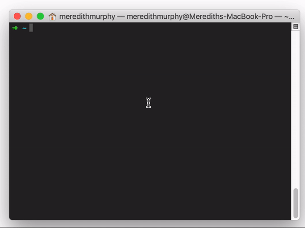
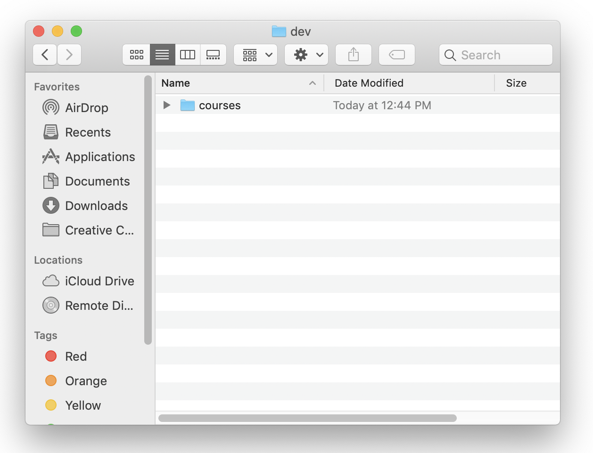

The Terminal is an application that gives you command line control over your system, meaning you can type commands in  text form and the computer does stuff. For developers the terminal is one of the most important tools in our toolbox. It may seem weird to want to use a simple text based command system when we have all these awesome graphics, but the Terminal gives you control over almost everything on your computer! It can also be faster and more flexible as you dive deeper into the world of coding.

Since it's one of our most important tools we are going to make sure to polish it up (we're going to make our terminal pretty and work well).

# Making Your Terminal Professional

> [action]
>
> 1. Use the keyboard shortcut `command` + `spacebar` and type "terminal" to open your terminal.
> 1. Now use the keyboard shortcut `command` + `,` to open your preferences (this keyboards shortcut works for every program on your computer!).
> 1. Set your profile to "Pro" and click "Default".

Looking professional! Don't worry about the profile for now, we're going to change it in the next section.

# Making a dev or code directory

All good developers have well organized folders and files in their computer. Always keep your folders, files, and desktop clean and organized. It will make you work faster and look and feel more professional.

> [info]
> Whenever you see code prefixed with a dollar sign $, that indicates that it's a command to be entered in the command prompt. Don't include the $ when you paste the command in.

A best practice to organize your code projects is to create one folder called either `dev` or `code` in the root of your computer.

> [action]
>
> 1. Use your terminal to make this now.
>
	```bash
	$ mkdir dev
	$ cd dev
	```
>
> 1. Now you are in your `dev` folder. You should create your portfolio coding projects in this folder!
> 1. Let's add one more thing which is a folder for your courses. In this folder you can make directories for your coursework.
>
	```bash
	$ mkdir courses
	```



Great! Now, if you explore the `dev` folder in Finder, you should see the `courses` folder we just created.

> [action]
>
> 1. Use the keyboard shortcut `command` + `spacebar` and type "finder" to open Finder.
> 1. In the menu at the very top of your screen, go to "Go" -> "Home".
> 1. Click on the "dev" folder to open it in Finder and check that it contains a folder "courses".



If this step was difficult for you, don't worry - we'll be going over Terminal in much more detail during Term 1.

# Show Hidden Files

As a developer, it's often very useful to be able to see hidden files and folders in Finder. They're hidden because messing with them can cause problems, but we're fancy-pants developers and we're not afraid.

Showing hidden files is useful because a lot of the coding tools we will be using have hidden files associated with them that aren't normally visible to an average computer user.

> [action]
>
> 1. Open your Finder application, go to File->New Window. Once the window is open press CMD + SHIFT + . which will tell the finder to show hidden files.

<!-- -->

# Homebrew

Homebrew is a package manager for Mac OS. It makes it easy to install software packages from the terminal while also installing and managing their dependencies. For more information, see the [Homebrew website](http://brew.sh/)

> [action]
>
> Install Homebrew by following the install instructions on the [Homebrew website](http://brew.sh/)

If you already have Homebrew installed, you need to update your formulae by running:

```bash
$ brew update
```

This may take several minutes to download updates, so be patient while it completes.


# Stretch Challenge: Learn Terminal Commands

## Note About Stretch Challenges

You'll frequently see Stretch Challenges throughout your time at Make School. These challenges are _optional_, and are there to help give you more practice, or to dive deeper into a topic. If you want to go the extra mile and enhance your learning, we encourage you to complete them after you have completed the required content for a chapter/project/lesson/etc.

## The Command Line or Terminal

As a software engineer, the command line will be your best friend! It allows you to more directly interact with your computer.

We'll be covering the terminal in more depth over the course of our Term 1 curriculum, but if you're ready to dive in now, here are some resources to start learning how to navigate your terminal:

> [challenge]
>
> Any time you see a green box like this with a trophy, it will indicate an _optional challenge_.
>
> Complete the **Chapters 1-2** of [Code Academy Command Line Tutorial](https://www.codecademy.com/learn/learn-the-command-line)
>
> This tutorial will familiarize you with the following commands:
>
> `ls`, `pwd`, `cd`, `mkdir`, `touch`, `mv`, `rm`, `cp`
>
> If you're looking to further your terminal knowledge even more, finish the remaining 3 chapters in the Code Academy tutorial.
