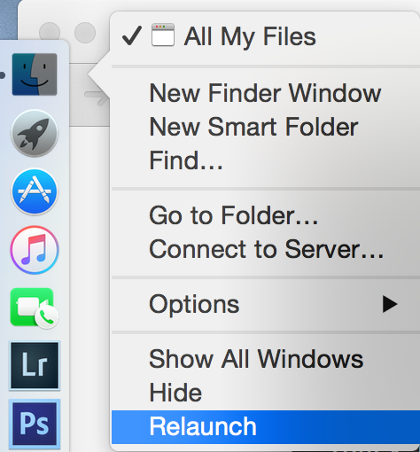

A developer lives in their terminal. So we're going to make our terminal pretty and work well.

# Making Your Terminal Professional

> [action]
>
> 1. Use the keyboard shortcut `command` + `spacebar` and type "terminal" to open your terminal.
> 1. Now use the keyboard shortcut `command` + `,` to open your preferences (this keyboards shortcut works for every program on your computer!).
> 1. Set your profile to "Pro" and click "Default".

Looking professional! Don't worry about the profile for now, we're going to change it in the next section.

# Making a dev or code directory

All good developers have well organized folders and files in their computer. Always keep your folders, files, and desktop clean and organized. It will make you work faster and look and feel more professional.

> [info]
> Whenever you see code prefixed with a dollar sign $, that indicates that it's a command to be entered in the command prompt. Don't include the $ when you paste the command in.

A best practice to organize your code projects is to create one folder called either `dev` or `code` in the root of your computer.

> [action]
>
> 1. Use your terminal to make this now.
>
	```bash
	$ ~ mkdir dev
	$ dev
	$ dev mkdir courses
	```
>
> 1. Now you are in your `dev` folder. You should move your portfolio coding projects into this folder and also where you should instantiate all new portfolio coding projects.
> 1. Let's add one more thing which is a folder for your courses. In this folder you can make directories for your coursework.
>
	```bash
	$ dev
	$ dev mkdir courses
	```

# Show Hidden Files

As a developer, it's often very useful to be able to see hidden files and folders in Finder. They're hidden because messing with them can cause problems, but we're fancy-pants developers and we're not afraid.

It's useful, because command line tools are installed in hidden folders, Git repositories live in hidden `.git` directories, your bash path file is a hidden file, etc.

> [action]
>
> 1. To do this, type this command into your command prompt:
>
	```bash
	$ defaults write com.apple.finder AppleShowAllFiles YES
	```
>
> 1. Then restart Finder by right clicking the Finder icon while holding the *option/alt* key and choosing relaunch.
>
	
>

<!-- -->

> [info]
> It's easy to reverse this change - just follow the same steps, replacing `YES` with `NO`.

# Homebrew

Homebrew is a package manager for Mac OS. It makes it easy to install software packages from the terminal while also installing and managing their dependencies. For more information, see the [Homebrew website](http://brew.sh/)

> [action]
>
> Install Homebrew by following the install instructions on the [Homebrew website](http://brew.sh/)

If you already have Homebrew installed, you need to update your formulae by running:

```bash
$ brew update
```

This may take several minutes to download updates, so be patient while it completes.


