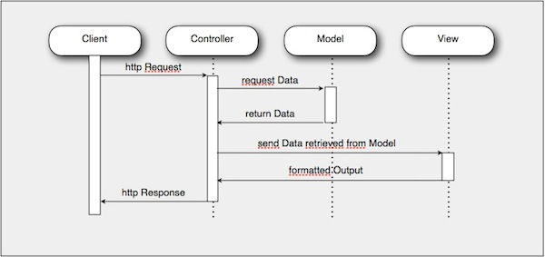
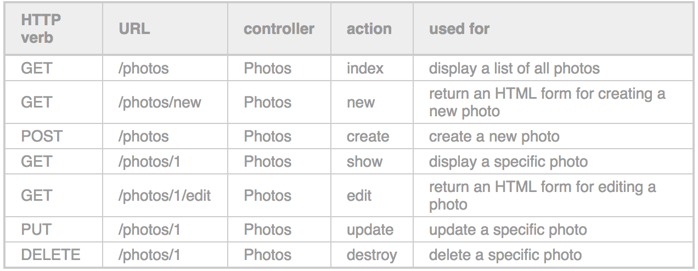

All Make School students learn how to build web servers, even folks who focus on mobile or who want to become data engineers. Why? Because almost every project that is connected to the internet in anyway must have a web server, if only a small one.

# The Request-Response Cycle

One of the most fundamental structures or paradigms of the internet is the **Request-Response Cycle**. This is how clients such as mobile phones and browsers, send requests to servers and receive responses of data, and assets such as HTML, CSS, and JavaScript files and images.

Watch this video to see one way to explain the Request-Response Cycle in terms of HTTP. **HTTP and the Web Explained | Request-Response Cycle** ~8 min


Research and answer the following questions:

  1. What is HTTP? What three criteria does it have?
  1. Draw your own diagram of the request-response cycle
  1. What are the standard HTTP status codes?

# MVC Architecture

The **Model-View-Controller Architecture** is arguably the most common architecture code can take inside both clients and servers. A simple way to think about MVC is to think of software working like a restaurant.

* Guest => User
* Menu => Views (HTML templates)
* Waiter => Controller
* Kitchen => Model
* Refrigerator => Database

A guest looks at the menu, tells the waiter what they want, the waiter tells the kitchen, the kitchen pulls raw ingredients from the refrigerator prepares them, the waiter brings them to the user and sets them down.

Likewise, a user looks at the views, clicks on something or submits a form which sends a message handled by the controllers, the controllers send a message to the model, the model grabs data from the database, the controller sends that data to the views again.



Watch What is Programming in MVC - Video - 24 min


Research and answer the following questions:

    1. Draw your own diagram of the MVC architecture.
    1. Why do web developers use the MVC architecture? What is an alternative?

# RESTful API - Video

A RESTful API means a backend server that can serve up data to clients (like mobile apps and websites) that ask. To get a better idea of what a RESTful API is, watch this brief video that shows how to build one in only 5 minutes.

Build a RESTful API in 5 Minutes with NodeJS-Updated.


# Resourceful Routes

Web servers are a complex mashup of code and concepts. Where should you start? How should you structure and name files, folders, variables, and methods? Web developers universally employ a concept called **Resources** to structure and name their files, variables, and methods. Similar to OOP, resources are like objects that have attributes and methods themselves. Here are the three resources a simple blog would have:

* Users
* Articles
* Comments

What can you do with resources? You can **CRUD** them:

* Create
* Read
* Update
* Destroy

Think about it. In a blog, you can make a new article, you can read an article, you can edit and update an article, and you can delete an article. You can make a new comment, read comments, edit and update comments or delete comments. Resources can be Created, Read, Updated and Destroyed in various ways - this is called **CRUDing Resources**.

CRUD can be spread out into seven common actions:

* New - See a form to make a new resource
* Create - Save the resource to the database
* Show - See one resource
* Index - See many resources
* Edit - see a form to edit an existing resource
* Update - save changes to an existing resource
* Destroy - delete a single resource

Each of these seven actions maps to a route and HTTP verb. It is important to follow this convention closely when building

Read, understand, and memorize the table of Resourceful Routing



# JSON

Data, data, data, everyone is so hot on data these days. Well how does data move around from say a server to your phone, or between your web browser and a service like Google or Airbnb or Uber? The answer is usually JSON - JavaScript Object Notation.

JSON is made up of **Key Value Pairs** and looks like this:

```json
{
  "name": "Bob",
  "age": 24,
  "pets": [
    {
      "name": "Pooch",
      "species": "Dog"
    }
  ]
}
```

To familiarize yourself more with JSON, please watch this great video on JSON called **JSON Crash Course** (30 min).


