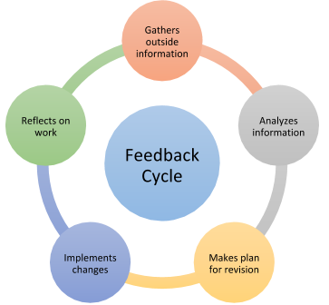

Before we wrap up, we wanted to highlight Make School's **culture of feedback.** We love hearing from students on what's working well, and we love it even more when we hear how we could be improving. Here are some of the things that came out of receiving student feedback:

- Office hours dedicated to math concepts used in data science
- More curriculum related to technical interviews
- More engaging morning activities during our Monday morning all-hands meeting

Source: [Teacher Certification Map](https://certificationmap.com/blog/supporting-the-feedback-cycle-in-the-classroom/)  

This cycle of receiving feedback, taking action on it, and asking for feedback on the improvement is a core procedure at Make School, and we want it to be crucial to you as well.

# Getting Feedback

At Make School, there are numerous opportunities for you to get feedback on your projects, yourself, or anything in between! Instructors and TAs will have _office hours_ to give you feedback, and you can also ask for a _code review_ from senior students to get a pair of fresh eyes on your project.

For these opportunities and more, we expect you to **ask questions!**

Source: [Skip Prichard](https://www.skipprichard.com/ask-questions-to-improve-your-leadership/)  

We're all learners here at Make School, and we welcome you to ask as many questions as you have. If you have a question, it's a guarantee that at least one other person has that same question.

> [action]
>
> Let's ask some questions now! Write down 3 questions you want get addressed during orientation
>
> Once you've done that, please fill out [this form](https://forms.gle/ctxDg2t9aWzsM6WQA) with what you hope to get out of during your first term at Make School

Hit the `Mark as Complete` box once you've done the above survey!

# Giving Feedback

As important as it is to get feedback, it's equally important to give feedback. The best way for us to meet your needs is by you telling us what they are!

We provide a variety of platforms for students to give feedback to us, from opening GitHub issues, to end-of-term feedback surveys, to town halls where we discuss feedback with students in a conversational setting. You can also always give us feedback via the `#make-school-feedback` channel on Slack!

In the spirit of collecting feedback, we'd love to hear your thoughts on this prework tutorial. **We promise this won't take longer than 2 minutes!**

> [action]
>
> Please take a moment to rate your understanding of the learning outcomes from this tutorial, and how we can improve it via our [tutorial feedback form](https://forms.gle/qpzzgfJA3zBByNsz9)

Hit the `Mark as Complete` box once you've done the above survey! And finally...

# That's a Wrap!
 **Congrats on completing your prework!**

 
 Source: [giphy](https://giphy.com/gifs/great-dicaprio-leonardo-rY93u9tQbybks)  

 We'll see you soon, and we're excited for you to be joining us 😁
