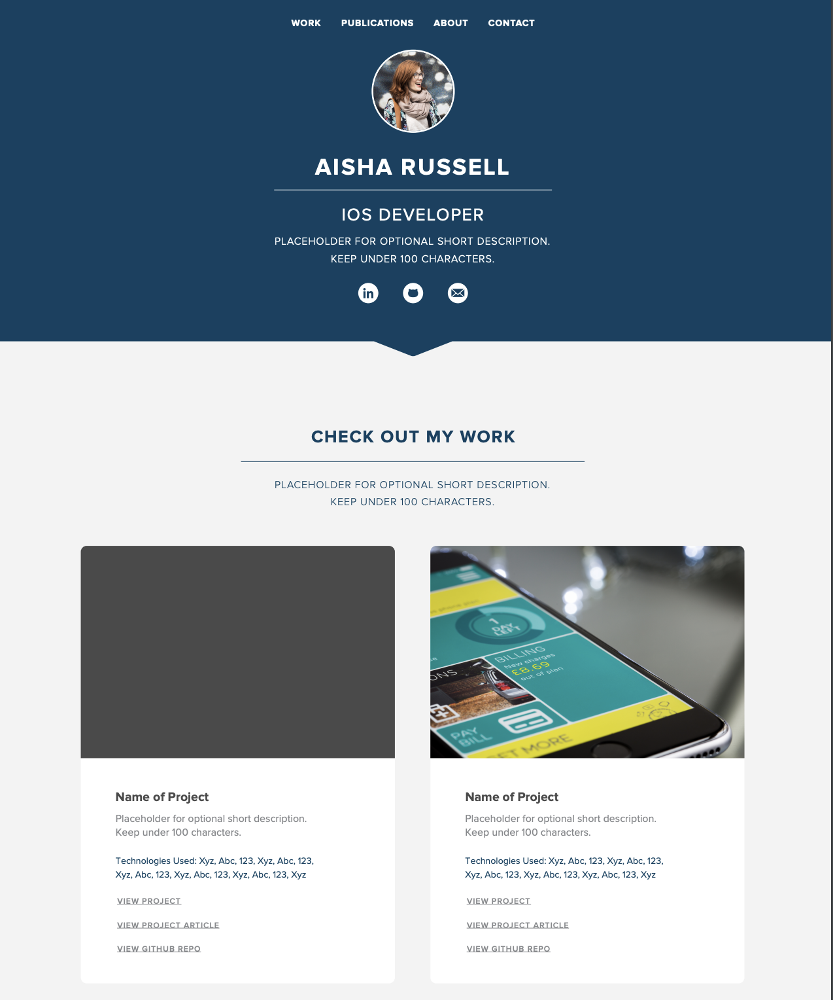

You may be set up like a software engineer, but you'll also need to level up your professionalism and communication skills to really help you shine in your future career. Former LinkedIn engineering director [Donnie Flood](https://www.linkedin.com/pulse/communication-key-software-engineering-donnie-flood/) says that "communication is key to successful software engineering and deserves more recognition for being so."

 We'll outline here how to accomplish this and set you on the path of success!

# Professionalism

Being professional does not come naturally. Let's repeat that: _being professional does not come naturally_. Professionalism is a set of behaviors that we all need to work on and train. We can break down professionalism into a few parts:

* **"Over" communicating** - communicating often and effectively with everyone you work with helps alleviate potential confusion and anxiety from not having enough information about a situation
* **Timeliness** - being on time to meetings and completing tasks demonstrates respect for others and their time
* **Speaking and Writing** - avoiding swearing, interrupting, and forms of communication that are out of sync with your environment with help to avoid social missteps
* **Attire/Hygiene** - wearing clean clothes that match the situation you are in, and keeping up with good hygiene practices like brushing your teeth and taking showers. You'd be surprised (or maybe you wouldn't be) at how often this can be forgotten!

 At Make School you'll have the opportunity to hone your professionalism and communication skills to a high level, but these short videos quickly cover the basics:

> [action]
>
> Watch the following videos to get a quick intro into the basics of professionalism:
>
>
>
>

# Communication

As stated above, the purpose of communication in a professional setting is to share information effectively and give those around peace of mind that they are as up to date on things as possible. In the real world, people get _fired_ for poor communication, so it is important to instill these practices now before you start working in industry where the stakes are higher.

> [action]
>
> Please review our recommended guidelines for effective communication across different mediums below:
>
> - **Email** - Use for archivable, important info that has deadlines, requires heavy action, or team coordination. Check email at least _once per day_. Respond to all emails within 24 hours with some response, even if it is just "I'll get back to you on Friday."
> - **Slack** - Use for impermanent, lightweight questions and coordination, or to share links or feedback. Check Slack at least _twice per day_. Respond to all Slack messages same day, even if it is just "I'll get back to you on Friday." Here's a [short video](https://www.youtube.com/watch?v=yGjsYf48Om4) about Slack if you are not familiar with the tool yet.
> - **In Person** - Use if the issue is too complicated for Slack or email. Be sure to check the other person's availability via their calendar first!
> - **Text Message** - Use texts when you need to coordinate urgent, same-day information with someone, e.g. if you are going to be late to a meeting. Otherwise use Slack or email.
> - **Phone Call** - Use a phone call in the cases of emergency or if a topic is too complex for text or email. If time allows, it's courteous to send a quick text or email first to ask if the other person is free for a call.

Lastly, remember that **it's ok to ask for help!** We are here to support you, please reach out!

# Bootstrapping Your LinkedIn Profile

Your LinkedIn profile is your online resume. It's one of the first things  recruiters will see when you apply for an internship or job. While we don't expect you to have a fully fleshed out profile just yet, but let's make sure you're up and running

> [action]
>
> Update and/or create your [LinkedIn](https://www.linkedin.com/) to include the following:
>
> - Your name
> - Profile Picture
> - Location (San Francisco Bay Area)
> - Summary
> - Set [Make School](https://www.linkedin.com/school/makeschool/) as your current school with your graduation year
> - List any programming/computer related projects under the "Experience" section of your profile

# Starting Your Make School Portfolio

Much of what you accomplish at Make School will be captured in your Make School portfolio. This is where your future projects will live that will be shown to prospective employers, and where you get the chance to talk about your background more.

Here's a sample of what a portfolio could look like:

> [action]
>
> Go start your [Make School portfolio](https://www.makeschool.com/portfolio/new) now with just your name, photo, and personal description. This page will eventually be shared with potential employers so please avoid any typos and do your best to make it look pretty!
>
> **IMPORTANT NOTE:** Write your personal description in the third person! Check out this [these examples](https://examples.yourdictionary.com/examples-of-writing-in-third-person.html) if you need some help crafting this.

# Organized Priorities

A part of improving your professionalism is keeping your work (or in this case, school) life organized. At Make School you will learn to be multiple times more productive than you have ever been. This increase in productivity is a superpower that will make you successful at Make School and in your future career as a software engineer.

We've broken down productivity into three parts:

* Staying Organized
* Removing Distractions
* Taking Action

It won't matter how well you have things organized if they are the wrong things!

> [action]
>
> Read this LifeHacker article, [Productivity 101: A Primer to the Getting Things Done (GTD) Philosophy](https://lifehacker.com/productivity-101-a-primer-to-the-getting-things-done-1551880955) for a quick overview of the popular GTD method.

As the GTD method acknowledges, there are countless ways to track todos, but unless you want to go insane, you need to **pick just one**.

> [action]
>
> Pick a todo tracking tool that works best for you! It could be the Apple Notes app, [Todoist](https://en.todoist.com/), [Trello](http://trello.com), [Asana](http://asana.com), or even a paper day planner or legal pad. Choose something that you think will work best for you. Remember it's ok to change later! Try something for now, and change it if it's not working out.

The key is to create a **Single Source of Truth** list: one source to hold all of your tasks. Otherwise, you’ll have multiple lists, double count tasks, lose track of what you put where, or scratch one thing off a list only to find it somewhere else.

To codify your types of work, productivity guru David Allen recommends categorizing your to-dos into four sections:

1. *Projects* - current work + action items
2. *Waiting On* - things you’re waiting on from other people
3. *Someday/Maybe* - dreams, possible projects
4. *Collection* - where you deposit new ideas and tasks

> [action]
>
> move all your todos to your newly chosen single source of truth

# Organized Calendar

Google Calendar is arguably the most important tool you will use at Make School and in your professional work. You will use it to see your classes, plan meetings with instructors and colleagues, make plans with mentors, find out about events, and much more.

> [action]
>
> Read through [Google Calendar's Help Center](https://support.google.com/calendar/?hl=en#topic=3417926) to learn how to do the following:
>
> 1. Create events
> 1. Invite guests to events
> 1. Allow guests to modify events
> 1. View another calendar
> 1. Block off time to work

# Removing Distractions

All the software on our phones and the internet are built to make you addicted to it. News, social media, emails, slacks, texts, snaps, etc. are all distractions that eat up the vital time you need to practice the craft of coding.

In order to be productive we have to remove all distractions and actively focus on coding projects. Below we outline how to chunk up your time to efficiently get work done:

## During a Work Block

While you are in a time block you do not check email or Slack or the news or Facebook, nothing. Instead you check your plan or todo list.

- Make a plan - always plan what you will do step-by-step
- Work off the plan - follow the plan you made
- Update the plan - as you learn more update your plan

How long should a work block be? We recommend a [Time Block, or timeboxing](https://en.wikipedia.org/wiki/Timeboxing) practice known as the [Pomodoro Technique](https://en.wikipedia.org/wiki/Pomodoro_Technique). This technique involves using a timer to focus your time into alternating work blocks and short breaks.

> [action]
>
> During the next chapter of this tutorial, try using the Pomodoro technique.

## The Rest of the Time

When you are not in a time block, you might be checking email, slack, and otherwise puttering around. This is OK, so long as you track what you need to do in the future. Try following these steps to guide you:

- If a task is 2 minutes - just do it
- If a task will take a fixed amount of time - schedule it on your calendar
- If a task will take an indeterminate amount of time - put it on your single source of truth.

# Optional Resources

The following cover the same topics as the above sections, but with some more information about other varieties of organization and productivity methods. Focus on picking a method and mastering it to help you improve your productivity.

- [Productivity & Organization self guided tutorial](https://drive.google.com/file/d/1eh9LIZdCK-EwNLtCxrp4jZLaSoIrjqbl/view?usp=sharing)
-  [Productivity Worksheet](https://drive.google.com/file/d/1dOoL6-4p_5jmMY2eMBjgNqJxwFdVpmR3/view?usp=sharing) to accompany the self guided tutorial
- Download [SelfControl](https://selfcontrolapp.com/) to literally block distracting sites.
